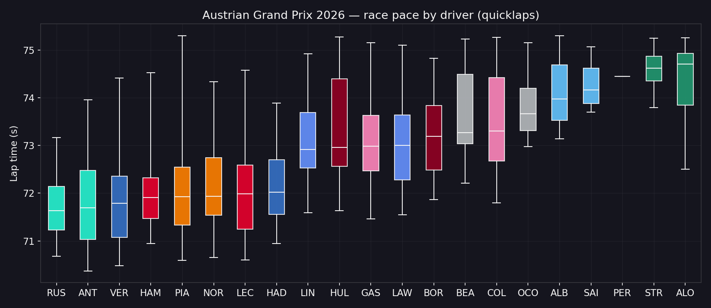
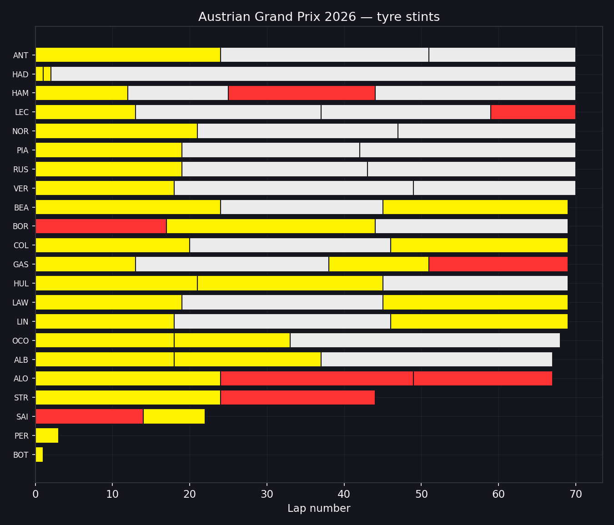
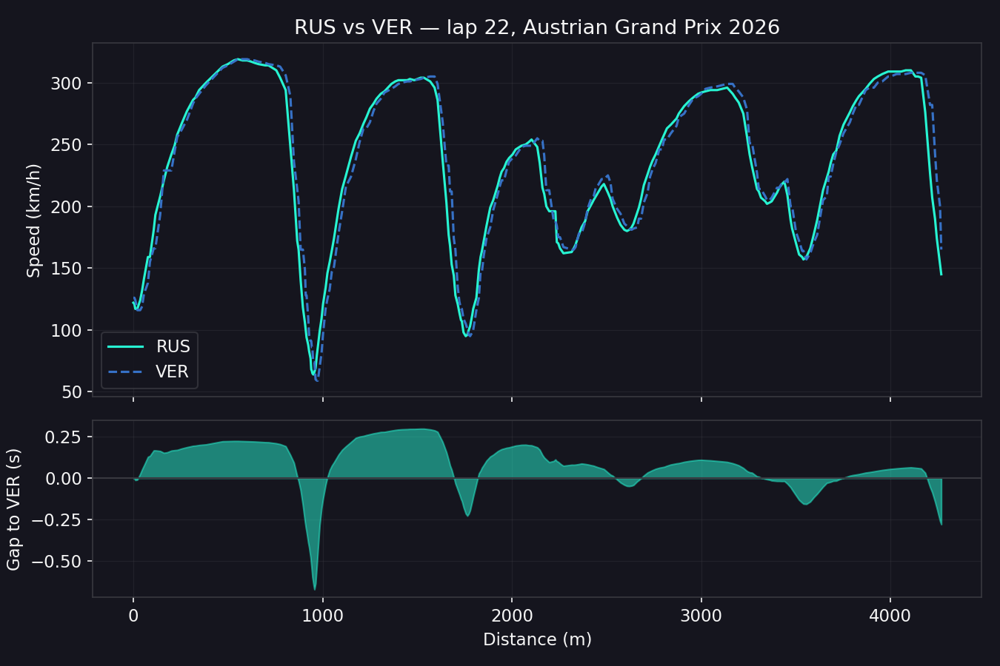

# Tutorial: plotting with matplotlib

`t1f1.plotting` deliberately ships only color/style **tokens** (see the
[Plotting API](../api-reference/plotting.md)), not chart-rendering helpers — that
keeps the core package free of a matplotlib dependency. This tutorial shows how to
combine those tokens with `t1f1.analysis` and plain matplotlib to build the charts F1
fans actually want, styled like a dark broadcast graphic.

Install the `plot` extra first:

```bash
pip install "t1f1-sdk[plot]"
```

Every chart below is real data — the 2026 Austrian Grand Prix race, fetched live,
no API key required. The full runnable source is
[`examples/plotting_matplotlib.py`](../../examples/plotting_matplotlib.py) — run it
directly (`python examples/plotting_matplotlib.py`) to regenerate these charts
against whatever session is currently live, or copy a recipe into your own script
and swap in a different `client.session(year, gp, session)`.

## Dark theme

Set these once via `plt.rcParams` for a broadcast-style dark background instead of
matplotlib's default white:

```python
import matplotlib.pyplot as plt

plt.rcParams.update({
    "figure.facecolor": "#15151E",
    "axes.facecolor": "#15151E",
    "axes.edgecolor": "#38383F",
    "axes.labelcolor": "#F5F5F5",
    "text.color": "#F5F5F5",
    "xtick.color": "#F5F5F5",
    "ytick.color": "#F5F5F5",
    "grid.color": "#38383F",
})
```

## 1. Race pace by driver

A proper box-and-whisker per driver, colored by team using
[`get_team_color`](../api-reference/plotting.md#get_team_colorteam-str--palette-dictstr-str--none--none---str),
built directly from [`session.driver_pace()`](../api-reference/analysis.md)'s
summary stats via matplotlib's `ax.bxp` (which takes precomputed quartiles/whiskers,
so no raw lap-time list is needed):

```python
from t1f1.plotting import driver_team_map, get_team_color

pace = session.driver_pace()
teams = driver_team_map(session.results())

stats = [
    {
        "label": row["driver"],
        "med": row["median"].total_seconds(),
        "q1": row["q1"].total_seconds(),
        "q3": row["q3"].total_seconds(),
        "whislo": row["min"].total_seconds(),
        "whishi": row["max"].total_seconds(),
        "fliers": [],
    }
    for row in pace.iter_rows(named=True)
]

fig, ax = plt.subplots(figsize=(10, 5))
boxes = ax.bxp(stats, patch_artist=True, showfliers=False)
for patch, row in zip(boxes["boxes"], pace.iter_rows(named=True), strict=True):
    patch.set_facecolor(get_team_color(teams[row["driver"]]))
ax.set_ylabel("Lap time (s)")
```



## 2. Tyre stint timeline

Colored by compound using [`get_compound_color`](../api-reference/plotting.md#get_compound_colorcompound-str--palette-dictstr-str--none--none---str),
built on [`session.tyre_stints()`](../api-reference/analysis.md):

```python
from t1f1.plotting import get_compound_color

stints = session.tyre_stints()
drivers = (
    stints.group_by("driver").agg(pl.col("end_lap").max())
    .sort("end_lap", descending=True)["driver"].to_list()
)

fig, ax = plt.subplots(figsize=(9, 7))
for row in stints.iter_rows(named=True):
    y = drivers.index(row["driver"])
    ax.barh(y, row["lap_count"], left=row["start_lap"] - 1,
            color=get_compound_color(row["compound"]))
ax.set_yticks(range(len(drivers)))
ax.set_yticklabels(drivers)
ax.invert_yaxis()
ax.set_xlabel("Lap number")
```



## 3. Speed trace + time-delta comparison

Built on [`session.compare()`](../api-reference/analysis.md) and
[`get_driver_style`](../api-reference/plotting.md#get_driver_styledriver--team-none-teams-none-teammate_index0-palettenone---dict),
which gives teammates the same color but a different linestyle so an overlaid line
plot stays readable:

```python
from t1f1.plotting import driver_team_map, get_driver_style

teams = driver_team_map(session.results())
comparison = session.compare("RUS", "VER")  # fastest lap for each, by default

fig, (ax_speed, ax_delta) = plt.subplots(2, 1, figsize=(9, 6), sharex=True, height_ratios=[2, 1])
ax_speed.plot(comparison["distance"], comparison["driver1_speed_kmh"],
              label="RUS", **get_driver_style("RUS", teams=teams, teammate_index=0))
ax_speed.plot(comparison["distance"], comparison["driver2_speed_kmh"],
              label="VER", **get_driver_style("VER", teams=teams, teammate_index=1))
ax_speed.set_ylabel("Speed (km/h)")
ax_speed.legend()

ax_delta.axhline(0, color="#38383F", linewidth=1)
ax_delta.fill_between(comparison["distance"], comparison["delta_seconds"], 0, alpha=0.5)
ax_delta.set_xlabel("Distance (m)")
ax_delta.set_ylabel("Gap (s)")
```



> **Real-feed gotcha:** the free live-timing feed's CarData stream can drop out
> for a stretch of a real session — a driver's flat-out fastest lap is sometimes
> outside that window, which shows up as a `lap_telemetry` frame that's non-empty
> but flatlined (speed stuck at 0). `examples/plotting_matplotlib.py`'s
> `_pick_comparable_lap` helper works around this by picking the fastest *common*
> lap where both drivers' telemetry actually covers real distance — worth
> reusing if you see an oddly empty comparison chart on a real session.

## Headless / CI usage

Set the `Agg` backend before importing `pyplot` if you're running outside a GUI
environment (this is what `examples/plotting_matplotlib.py` does):

```python
import matplotlib
matplotlib.use("Agg")
import matplotlib.pyplot as plt
```
